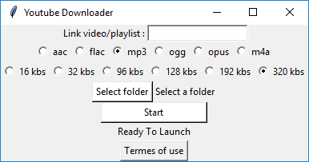

# Youtube to mp3 converter

A basic application to be able to download the sound of a video or playlist to Youtube



## Basic use

You must have python on your computer and the youtube_dl library :
```
pip install --upgrade youtube_dl
```
Then you can start the app with the command :
```
python YoutubeToMp3.py
```
1. Add the link of the video or the playlist you want to convert
2. Choose the codec of the sound (default : .mp3)
3. Choose the audio rate of the sound (default : 320 kbs)
4. Choose the folder where you want to save the sound(s) (default : where you launch the app)
5. If there are no errors, a progress bar will appear. It will be present until everything is downloaded successfully

__WARNING__ : If another console is displayed during the download, do not close it

## Create a .exe of the app

It may be easier to use if you only have an .exe to use the application.
Then you have to install pyinstaller :
```
pip install pyinstaller
```
After that, run the next command :
```
pyinstaller --onefile --windowed YoutubeToMp3.py
```
You will have the .exe in the __dist__ folder. You can delete the rest.

## Terms and use

You may not infringe the copyright, trademark or other proprietary informational rights of any party.
The creators are not responsible for your use of the software.